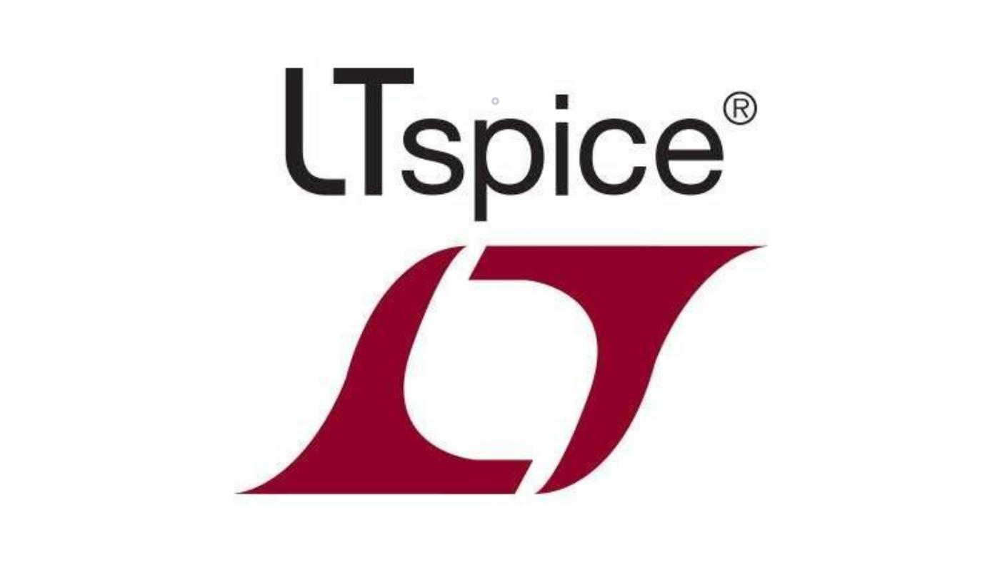
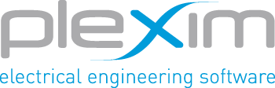
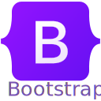
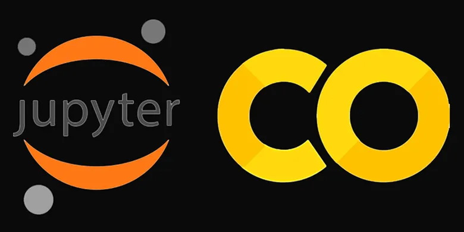
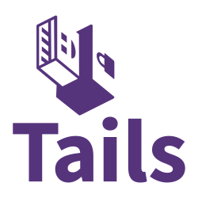

[](mailto:irumesh.work@gmail.com)


<!--- # Holà Amigo 👋🏻, I'm [Rumesh](https://irumesh.github.io/)! --->
### About 🙋🏻‍♂️
```python
Name = "Rumesh"
$ whoami = ['R & D Engineer', 'Embedded Engineer','Developer','Coder','Linux Lover','Noobie']
Occupation = "Problem Solver"
Hardware = "Raspberry Pi Zer 2W, 3B, 4B, 5", "Jetson Nano", "Arduino Family", "ESP Family"
Favourite Quotes: "Remember my friend, Hugs are worth more than handshakes.",
                  "You wanna make an Omelette, you gotta break some eggs."
                  "It's not who I am underneath, but what I do that defines me."
```
<!-- <p style = "line-height: 80%">
An enthusiastic individual who loves exploring new technology and who has the ability to come up with better solutions.  <br/>
  ✨ A Electrical & Electronics Engineer and Linux Enthusiast <br/>
  🌱 I work closely electrical and electronics systems <br/>
  ✔️ I believe in sharing, learning and growing together. Extremely motivated to develop my skills constantly and grow professionally. Also, I possess
    great communication and leadership skills.
<br>
</p>


<p align="left">  </p> -->


- 🌱 I’m currently looking for <b>Opportunities for growth</b><br>
- 🔭 I’m currently exploring <b>FastAPI, IIoT & Embedded Systems</b><br>
- 💬 Ask me about <b>Electronics, Open Source Contributions, Linux system and Docker</b><br>
- 👯 I’m looking to collaborate on Open Source Projects <!-- - 📫 Reach me at : --><br>
- ⚡ Fun fact: I love repairing the broken and travelling to explore new places.<br>
- ❤️ Trying to be a better person through a wisdom of knowledge. <br>
<br/>

<!--
## 🚀 My Blogs
I love exploring technology and documenting stuff that I come across and find interesting. Hoping that you will love reading it :)<br><br>
[]()
-->

## 🤝 Connect with me
<p>
I love networking and connecting with people of different backgrounds and hence I'm an active member of numerous technical and non-technical clubs and societies⚡
<br/>
You can connect with me here ╰┈➤
</p>


<!-- [](www.linkedin.com/in/irumesh) -->
[](https://t.me/RumeshW)
<!---
[](mailto:)
[](https://rumesh.is-a.dev/home/404%20Error%20page/index.html)
[](https://rumesh.is-a.dev/home/404%20Error%20page/index.html)
--->
## 🚀 Languages and Tools

**Embedded System Product Development:**
<p align="left"> 
<code></code>
<a href="https://www.arduino.cc/" target="_blank">  </a> 
<code></code>
<code></code>
<!-- <code></code>
<code></code>
<code></code> -->
<code></code>
<a href="[https://www.gnu.org/software/bash/](https://code.visualstudio.com/)" target="_blank">  </a> 
<a href="https://easyeda.com/" target="_blank">  </a> 
<code><a href="https://www.altium.com/altium-designer/" target="_blank"></code>
<a href="https://www.mathworks.com/products/matlab.html" target="_blank">  </a> 
<a href="https://www.autodesk.com/solutions/electrical-design" target="_blank">  </a> 
<code><a href="https://www.analog.com/en/design-center/design-tools-and-calculators/ltspice-simulator.html" target="_blank"></code>
<code><a href="https://www.plexim.com/products/plecs" target="_blank"></code>
<code><a href="https://www.labcenter.com/" target="_blank"></code>
<a href="https://www.xilinx.com/content/dam/xilinx/support/documents/sw_manuals/xilinx14_7/irn.pdf" target="_blank">  </a> 
</p>


**Coding :**
<p align="left"> 
<a href="https://www.gnu.org/software/bash/" target="_blank">  </a>
<a href="https://www.w3schools.com/cpp/" target="_blank">  </a>
<a href="https://www.python.org" target="_blank">  </a> 
<a href="https://www.verilog.com/" target="_blank">  </a> 
<a href="https://nodejs.org" target="_blank">  </a> 
<a href="https://www.w3.org/html/" target="_blank">  </a> 
<a href="https://www.w3schools.com/css/" target="_blank">  </a>   
<a href="https://getbootstrap.com" target="_blank">  </a>  
<a href="https://git-scm.com/" target="_blank">  </a> <a 
<a href="https://www.apache.org/" target="_blank">  </a> 
<a href="https://www.mysql.com/" target="_blank">  </a> 
<a href="https://www.php.net" target="_blank">  </a> 
<a href="https://www.latex-project.org/" target="_blank">  </a> 
<a href="https://colab.research.google.com/" target="_blank">  </a> 
<code></code>


**Planning & Project Management :**
<p align="left"> 
<code></code>
<code></code>
<code></code>
<code></code>


## 💻 Operating System
<p align="left">
<a href="" target="_blank">  </a> 
<a href="" target="_blank">  </a> 
<!--- <a href="" target="_blank">  </a> -->
</p>

<!---
iRumesh/iRumesh is a ✨ special ✨ repository because its `README.md` (this file) appears on your GitHub profile.
You can click the Preview link to take a look at your changes.
--->

[](mailto:irumesh.work@gmail.com)
